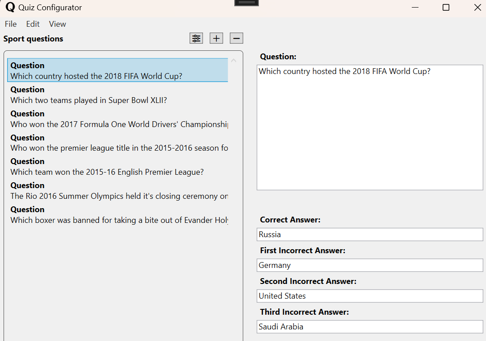

# Quiz Configurator

This is my third assignment for my .NET studies at IT-Högskolan. Assignment submitted in november 2024. 

## Project Overview

Quiz Configurator is a WPF application that allows users to configure and run quiz questions. The application is built using the Model-View-ViewModel (MVVM) architecture and offers a user-friendly interface for managing question packs and gameplay.

## Key Features

### Configuration Mode

* **Pack Options:** Ability to name packs, set difficulty levels and configure time limits for answering each question.
* **Create and Manage Questions:** Users can add, remove and edit questions. Each question contains four answer optiones, of which one is correct. All questions are stored in a specific question pack. The application enables users to delete multiple questions simultaneously using a multi-select feature.

* **Multiple Management Methods:** Questions and question packs can be added, edited and removed via menu selections, shortcut keys or buttons whitin the app.

### Play Mode 

* **Question Session:** The application displays the number of questions and the current question in order. The order of questions and options are randomized.
* **Icons:** When choosing a answer the program interacts with icons to display weather its correct or incorrect.

* **Timer:** A countdown timer is set for each question displaying how much time is left to answer the question. When it´s 5 seconds left the program will start ticking if the sound is on.

  
* **Speeker:** If sound is on, the question is read with Microsoft Zira Desktop voice. The voice also tells if the answer is correct or wrong.
* **Game Finished:** When the game is over user gets their results and the possibility to eighter play again or leave player view.

  
### Menu 

* **User-Friendly Navigation:** The menu features icons and supports keyboard shortcuts to activate options.

 

### Persistece and File Management

* **JSON Saving:** Question packs and questions are saved in JSON format. When entering the program packs and questions are loaded from JSON. When adding a new pack or question, pressing Ctrl+S and exiting the program packs and questions are saved in JSON.
* **Asynchronous Handling:** File operations are conducted asynchronously to ensure the user interface remains responsive.

#### Import Questions via API

* **API Integration:** Users can import questions from the Open Trivia Database, slecting categories and difficulty levels.
* **Asynchronous Handling:** Calls and error handling is contributed asynchronously.
* **Status Information:** The user is constantly updated asynchronously about the status of the interaction with Open Trivia Database.

### Technologies and Structure

* **WPF and XAML:** The program is built in WPF with graphical user interface.
* **MVVM:** The user interface and business logic is separated for a better maintainability and testability.

